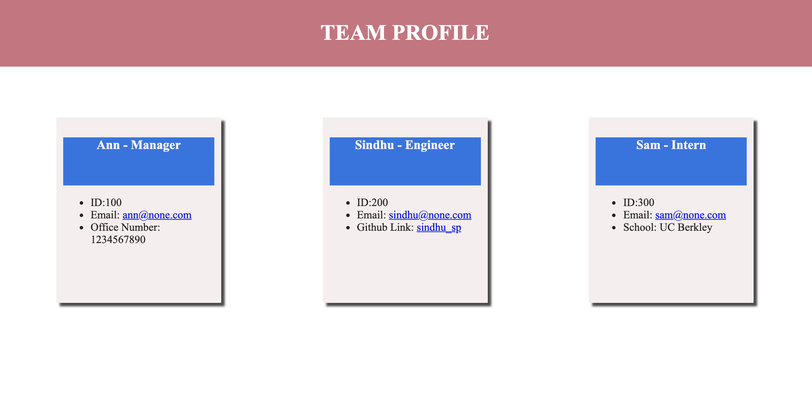

# Team_Profile_Generator

## About this challenge

In this challenge it is to build a Node.js command-line application that takes in information about employees on a software engineering team and generates an HTML webpage that displays summaries for each person. 

## User Story

AS A manager, the user want to generate a webpage that displays the team's basic info
so that the manager have quick access to their emails and GitHub profiles

## Criteria

- A command-line application that accepts user input is given

- When prompted for the team members and their information, then an HTML file is generated that displays a nicely formatted team roster based on user input.

- When clicked on an email address in the HTML, then the default email program opens and populates the TO field of the email with the address.

- When clicked on the GitHub username, then that GitHub profile opens in a new tab.

- When starting the application, then prompted to enter the team manager’s name, employee ID, email address, and office number.

- When entered the team manager’s name, employee ID, email address, and office number, then presented with a menu with the option to add an engineer or an intern or to finish building my team.

- When selecting the engineer option, then prompted to enter the engineer’s name, ID, email, and GitHub username, and taken back to the menu.

- When selecting the intern option, then prompted to enter the intern’s name, ID, email, and school, and taken back to the menu.

- When deciding to finish building my team, then exit the application, and the HTML is generated

## The Program Guidelines

The application uses Jest for running the unit tests and Inquirer for collecting input from the user. The application will be invoked by using the following command:

- node index.js

The directory structure that looks like this:

- tests            // jest tests
  -  Employee.test.js
  -  Engineer.test.js
  -  Intern.test.js
  -  Manager.test.js

- dist/               // rendered output (HTML) and CSS style sheet
- lib/                // classes
- src/                // template helper code
- index.js            // runs the application

The application have these classes: Employee, Manager, Engineer, and Intern. The tests for these classes (in the _tests_ directory) all passed.

The first class is an Employee parent class with the following properties and methods:

- name
- id
- email
- getName()
- getId()
- getEmail()
- getRole() // Returns 'Employee'

The other three classes will extend Employee.

In addition to Employee's properties and methods, Manager will also have:

- officeNumber
- getRole() // Overridden to return 'Manager'

In addition to Employee's properties and methods, Engineer will also have:

- github // GitHub username
- getGithub()
- getRole() // Overridden to return 'Engineer'

In addition to Employee's properties and methods, Intern will also have:
school

- getSchool()
- getRole() // Overridden to return 'Intern'

- The following image demonstrates the application functionality:

## Team Profile Generator Demo

## Deployed Site
<https://sindhu-sp.github.io/Weather-Dashboard/>

## Technologies Used:
- HTML
- CSS
- Javascript

#### Sindhu Pillai

